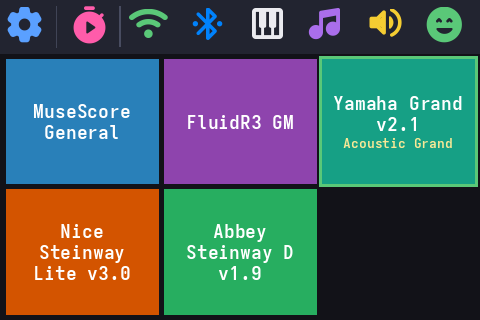
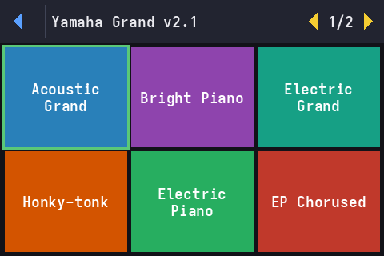
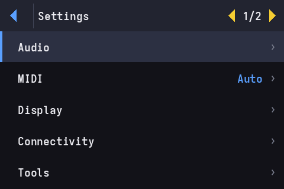
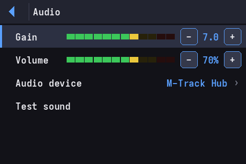

# pisynth

A Raspberry Pi turned into a standalone **MIDI synthesizer appliance**: plug in a USB
MIDI keyboard and a USB audio interface, power on, and play — with a **touchscreen
control UI** on a small 3.5" SPI display. No desktop, no mouse; it boots straight into
the synth.

Built on **fluidsynth** (SoundFont playback, direct ALSA for low latency) with a
lightweight framebuffer UI (no X / no Wayland) driven by touch — and, soon, by the
keyboard's D-pad.

> Evolved from a headless NanoPi build (`nanosynth`). pisynth adds the touchscreen, a
> menu UI, and a migration-based deploy workflow.

## Features

- 🎹 Boots straight into a playable instrument (any General MIDI SoundFont); hot-swap the
  keyboard or audio interface and it recovers.
- 🖥️ 3.5" touchscreen UI — instrument **tiles** + a **Settings** menu: gain/volume, audio
  output (USB card **or Bluetooth** speaker), a **MIDI device picker + live test keyboard**,
  a **metronome**, system info & **health**, and touch calibration.
- 🪶 Light & fast: no desktop to load, so it boots straight to the synth in seconds and the
  sound stays low-latency.
- 🔧 One-command install, and an easy way to add your own SoundFonts (drop them in, run one
  command).
- 🖧 No monitor needed: the desktop only starts if you actually plug in an HDMI screen.

## Screenshots

The 3.5" touchscreen (480×320). Home is one tile per SoundFont; tap to drill into its
presets; the gear opens Settings.

| | |
|---|---|
|  |  |
| **Home** — one tile per SoundFont (selected one framed green) | **Presets** — tap a tile to pick the instrument |
|  |  |
| **Settings** — Audio / MIDI / Display / System… | **Audio** — gain, volume, output device, test sound |

## Hardware

| Part | Tested with |
|------|-------------|
| Board | **Raspberry Pi 3B+**, Raspberry Pi OS *Trixie* (64-bit) |
| Screen | 3.5" SPI, **ILI9486 + ADS7846** ("goodtft/MPI3501" red board) via the `piscreen` overlay |
| MIDI keyboard | **M-Audio Keystation 61 MK3** (USB) |
| Audio out | **M-Audio M-Track** (USB interface) — the Pi 3.5 mm jack works but sounds poor |

Using a different SPI panel? The screen is described in **[`hardware.conf`](hardware.conf)**
(overlay name, SPI speed, rotation); edit it and re-deploy. Resolution and the ADS7846
touch are auto-detected.

## Quick start

> New to this? **[INSTALL.md](docs/install.md)** is the full step-by-step (flashing, SSH keys,
> Windows/WSL, on-device install, troubleshooting). The short version:

First, on the Pi: flash Raspberry Pi OS, enable SSH + key-based login, and wire up the
3.5" screen. Then pick one of two ways to install:

**End user — one command, on the Pi.** Copy this repo onto the Pi (`git clone` there, or
`scp` it over), then:

```bash
sudo ./install.sh        # installs everything in one apt batch, configures, and reboots
```

**Developer — from your computer (edit → deploy loop).**

```bash
git clone https://github.com/quazardous/pisynth
cd pisynth
cp pisynth.conf.dist pisynth.conf      # edit PISYNTH_HOST=user@your-pi
./deploy.sh                            # rsync repo → Pi, run migrations (asks sudo once)
```

Both reboot the Pi themselves when boot config changed (screen overlay, console, splash),
so the first run comes up ready — no manual reboot.

Plug the keyboard + USB audio interface into the Pi. On first boot the screen runs a
**touch calibration** (tap the 4 targets), then shows the instrument tiles. Press a key.

## How it works

Your keyboard plays through **fluidsynth** (the software synth), which sends the sound
straight to your USB audio interface — a short path, kept that way for low latency. The
touchscreen and the keyboard's D-pad don't make sound themselves; they just **control** the
synth (pick an instrument, set the volume, start the metronome).

With no monitor attached it boots straight to the synth; the desktop only starts if you plug
in an HDMI screen, so the little screen is never fought over.

<details><summary><strong>Under the hood</strong> (for tinkerers)</summary>

```
Keystation 61 MK3 ──USB──┐
                          ├─► fluidsynth (ALSA direct, TCP shell :9800) ─► USB audio ─► sound
USB audio interface ──────┘                  ▲
                                             │ prog / gain commands
                  ┌──────────────────────────┼───────────────────────────┐
            midi-bridge.sh (D-pad)   touch UI (/dev/fb0, control socket :9810)
```

The touch UI (`ui/pisynth-ui.py`) draws straight to the framebuffer and drives fluidsynth
over its TCP shell — the same control plane the D-pad uses. See [DEV.md](docs/dev.md) for the
full architecture.
</details>

## SoundFonts

Just copy your own `.sf2` / `.sf3` files into the SoundFonts folder on the Pi
(`~/soundfonts/`) — they're loaded next time it starts. The base SoundFonts (MuseScore
General, FluidR3 GM) are installed automatically.

> Developing from a laptop? Drop them in the repo's [`soundfonts/`](soundfonts/README.md)
> and re-deploy instead.

## Development

See **[DEV.md](docs/dev.md)** — the deploy workflow, the screenshot/remote-control feedback
loop, the menu-UI SDK, and how to add screens. Design rationale lives in **[RESEARCH.md](docs/research.md)**.
All docs are under **[docs/](docs/)**.

## Status

Work in progress. The touchscreen UI, calibration, and deploy/migration tooling work; the
end-to-end audio path is being validated on hardware. See docs/dev.md / docs/research.md.

## License

[MIT](LICENSE) © 2026 David Berlioz
