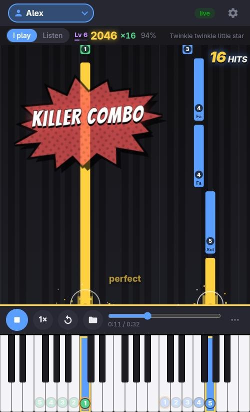
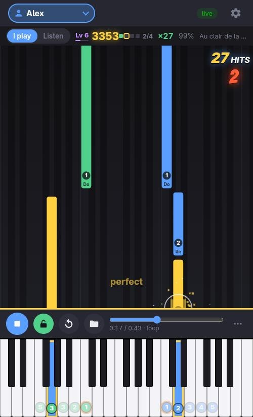
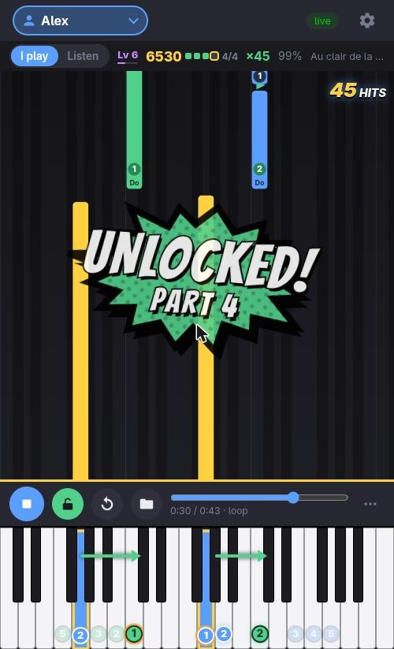
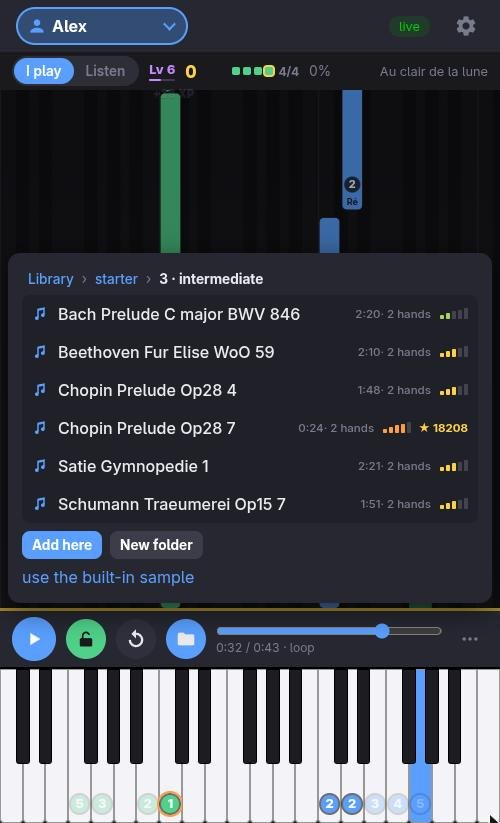
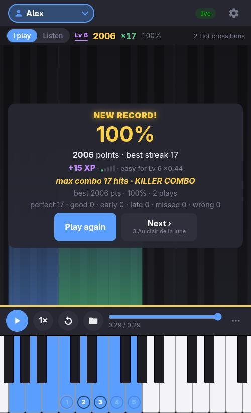

# pisynth

A Raspberry Pi turned into a standalone **MIDI piano synthesizer**. Plug in a USB MIDI keyboard
and a USB audio interface, power on, and play. A small **3.5" touchscreen** picks the sound.
Your **phone** becomes a play-along coach: the notes fall onto the keyboard, you hit them, and
the combos pile up.

<p align="center">
  
</p>

Built on **fluidsynth** (SoundFont playback, straight to ALSA for low latency), a framebuffer
touch UI (no X, no Wayland), and a web companion served by the Pi itself. Nothing leaves your
local network.

## Features

### The instrument
- 🎹 **Boots straight into a playable piano**, with any General MIDI SoundFont. Replug the keyboard or the audio interface and it recovers by itself.
- 🖥️ **3.5" touchscreen UI:**
  - one tile per SoundFont, then its presets;
  - Settings: gain and volume, audio output (USB card or Bluetooth speaker), MIDI keyboard picker with a live test keyboard, metronome, system health, touch calibration.
- 🥁 **Metronome** on the piano speakers, with tempo presets and a beat pulse. It can be started from a key on your keyboard.
- 🪶 **Light and fast.** No desktop to load; the desktop only starts if you plug in an HDMI screen.
- 🛡️ **Optional read-only mode.** Unplug at the wall without corrupting the SD card.

### The web companion (your phone)
Scan the QR code on the pisynth screen; the page is served over HTTPS by the Pi (its certificate is
optional: the companion also works after accepting the browser's warning).
- 🎮 **Play along.** The song's notes fall onto the keyboard, rock-game style, and your timing is judged from the moment you pressed the key: perfect, good, early, late, miss.
  - The timing windows follow the song's tempo and the tempo slider (50 to 150 %).
  - A–B loop, a video-game count-in, notes that shake as they reach the line.
  - ↻ goes back to the start; **Next ›** loads the following song.
- 🔓 **Three play modes:**
  - **hybrid** (the default): a song unlocks part by part, each verse or phrase to be played without a mistake, with a countdown that heats up before "UNLOCKED!";
  - **normal**: the whole song, once;
  - **infinite**: it loops, with a score that climbs and drops.
- 💥 **Arcade effects:** sparks on every hit, Killer Instinct-style combos (TRIPLE … KILLER … ULTRA) in comic-book splashes, an OOPS on wrong keys, a racing score.
- ✋ **Help for the hands:**
  - a suggested finger on every note;
  - the five fingers of each hand always placed on the keyboard (the thumb ringed in orange);
  - hand moves shown blue → green with an arrow;
  - ghost keys for the perfect timing.
- 👥 **Several musicians** on one phone: each with a colour, their own level, records and help options.
- 📈 **Progress:**
  - XP and levels: harder songs and faster tempos earn more;
  - each song's difficulty shown as a gauge;
  - your best score per song.
- 📚 **MIDI library on the Pi,** organised by level:
  - homer and first steps: whole children's songs, arranged here and cut into parts;
  - beginner, intermediate and advanced: public domain classics;
  - plus your own files, from the computer or uploaded from the phone.
- 🎧 **Listen mode.** pisynth plays the song and the same notes light up as they sound.
- 🎛️ **The synth's settings from the phone:** sound, reverb, chorus, metronome… Note names in English or French.
- ⏱️ **Latency check** with the phone's microphone.

| | |
|---|---|
|  |  |
| **Hybrid** · parts to unlock, the countdown heating up | **Unlocked** · hand moves, blue → green |
|  |  |
| **Library** · difficulty gauge, your ★ best | **Results** · record, XP, best combo, Next › |

## The touchscreen

The 3.5" screen (480×320). Home shows one tile per SoundFont; tap one to see its presets. The
gear opens Settings.

| | |
|---|---|
|  |  |
| **Home** — one tile per SoundFont (selected one framed green) | **Presets** — tap a tile to pick the instrument |
|  |  |
| **Settings** — Audio / MIDI / Display / System… | **Audio** — gain, volume, output device, test sound |

## Hardware

| Part | Tested with |
|------|-------------|
| Board | **Raspberry Pi 3B+**, Raspberry Pi OS *Trixie* (64-bit) |
| Screen | 3.5" SPI, **ILI9486 + ADS7846** ("goodtft/MPI3501" red board) via the `piscreen` overlay |
| MIDI keyboard | **M-Audio Keystation 61 MK3** (USB) |
| Audio out | **M-Audio M-Track** (USB interface). The Pi's 3.5 mm jack works but sounds poor. |
| Phone (companion) | any recent phone browser on the same Wi-Fi |

Using a different SPI panel? The screen is described in **[`hardware.conf`](hardware.conf)**
(overlay name, SPI speed, rotation); edit it and re-deploy. The resolution and the ADS7846 touch
controller are detected automatically.

## Quick start

> New to this? **[INSTALL.md](docs/install.md)** has the full step-by-step: flashing, SSH keys,
> Windows/WSL, installing on the device, the phone companion, troubleshooting. The short version:

First, on the Pi: flash Raspberry Pi OS, enable SSH with key-based login, and wire up the 3.5"
screen. Then pick one of two ways to install.

**End user: one command, on the Pi.** Copy this repo onto the Pi (`git clone` there, or `scp`
it over), then:

```bash
sudo ./install.sh        # installs everything in one apt batch, configures, and reboots
```

**Developer: from your computer (edit → deploy loop).**

```bash
git clone https://github.com/quazardous/pisynth
cd pisynth
cp pisynth.conf.dist pisynth.conf      # edit PISYNTH_HOST=user@your-pi
./deploy.sh                            # rsync repo → Pi, run migrations
```

Both reboot the Pi themselves when the boot config changed, so the first run comes up ready.

Plug the keyboard and the USB audio interface into the Pi. On first boot the screen runs a
**touch calibration** (tap the 4 targets), then shows the instrument tiles. Press a key.

**Phone:**
1. Tap the **QR icon** on the pisynth screen and scan it.
2. The first time, the page helps you install pisynth's small certificate authority, limited to your local network, so the companion opens like any secure site. It can be installed as an app.
3. From a computer, `./pair.sh --open` does the same.

## How it works

Your keyboard plays through **fluidsynth**, which sends the sound straight to the USB audio
interface. That path is kept short for low latency. The touchscreen, the keyboard's D-pad and
the phone don't make sound: they **control** the synth.

The phone receives only the raw MIDI events you play, a few bytes each; the sound stays on the
Pi's speakers. All the heavy lifting runs **in the phone's browser**, so the Pi 3B+ stays free
for audio: note highway, judging, fingering, difficulty, effects.

<details><summary><strong>Under the hood</strong> (for tinkerers)</summary>

```
Keystation 61 MK3 ──USB──┐
                          ├─► fluidsynth (ALSA direct, TCP shell :9800) ─► USB audio ─► sound
USB audio interface ──────┘              ▲
                                         │ prog / gain / notes
        ┌────────────────────────────────┼─────────────────────────────────┐
  midi-bridge.sh (D-pad)     touch UI (/dev/fb0, :9810)     pisynth-web (aiohttp, HTTPS)
                                                                  │  WebSocket: MIDI events
                                                                  ▼
                                                     phone browser (Svelte app)
```

- **Touch UI:** the `ui/pisynth/` Python package draws straight to the framebuffer and drives fluidsynth over its TCP shell, the same control plane as the D-pad.
- **Web companion:** a single-worker asyncio service (`web/`) serves the Svelte app (`web/app` → `web/static`) and relays the ALSA sequencer's MIDI to the paired phone.

See [DEV.md](docs/dev.md) for the full architecture.
</details>

## SoundFonts and MIDI files

- **SoundFonts:** copy your `.sf2` / `.sf3` files into `~/soundfonts/` on the Pi; they're loaded the next time it starts. MuseScore General and FluidR3 GM are installed automatically.
- **MIDI files:** drop them in the repo's [`midi/`](midi/README.md) folder (subfolders are kept) and re-deploy, or upload them from the phone into any library folder.

## Development

See **[DEV.md](docs/dev.md)** for:
- the deploy workflow;
- the screenshot and remote-control feedback loop;
- the menu-UI SDK;
- the web companion's dev stack (`make dev`, with a simulated keyboard that can play along).

Design rationale lives in **[RESEARCH.md](docs/research.md)**. All docs are under **[docs/](docs/)**.

## Status

Work in progress: 0.5.0 is not released yet. See [CHANGELOG.md](CHANGELOG.md) for what changed
in each version.

## Credits

- The starter classical pieces come from the [Mutopia Project](https://www.mutopiaproject.org/) (public domain). The homer and first steps arrangements are ours, released as CC0. Details in [library/midi/SOURCES.md](library/midi/SOURCES.md).
- The comic lettering uses the [Bangers](https://github.com/googlefonts/bangers) font (SIL Open Font License 1.1, bundled). The comic splashes are drawn by the app itself.
- The fingering model follows Parncutt et al. (1997), *An ergonomic model of keyboard fingering for melodic fragments*.

## License

[MIT](LICENSE) © 2026 David Berlioz
